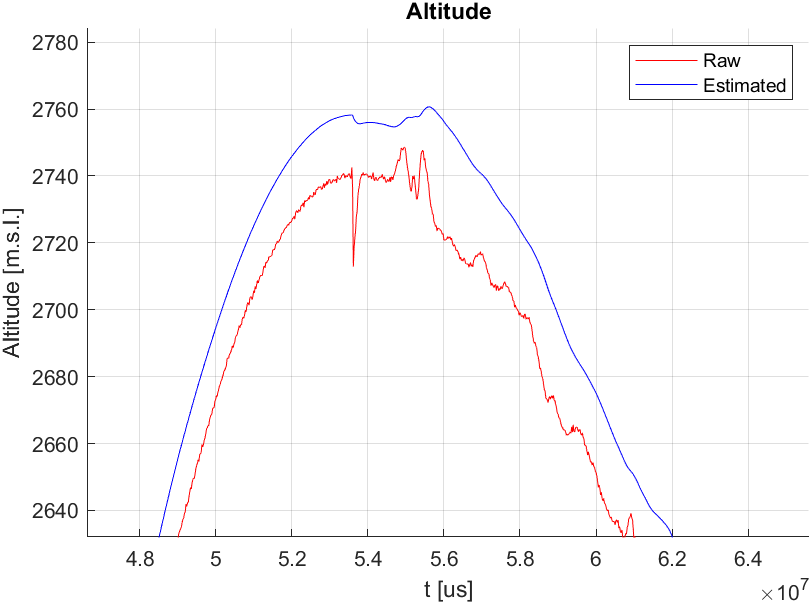

# SkyWard Recruitment Assignment

This repository contains my solution to the SkyWard Recruitment Assignment, focused on detecting crucial events during a rocket launch, flight, and landing based on sensor data, including pressure and acceleration. The implementation is written in C and is based on a Kalman filter to smooth the data and detect the events.

## Logical Solution

Since the given set of data is composed by a series of raw measurements of the pressure and the acceleration of the rocket, the first step is to filter the data to remove the noise.

**To reduce noise in the sensor data I've opted for a Kalman filter**, which is an iterative algorithm that predicts and updates the true state of the system, making it ideal for smoothing sensor data and predicting future states of the rocket.

<br>

<div align="center">
    
    <br>
    <figcaption>Application of the Kalman filter to the altitude datas</figcaption>
</div>

<br>

**Having a filtered set of data, the next step is to detect the events.** There where a lot of possible criteria to detect a certain event, but based also on papers founded on the internet and a some simulations with `MATLAB`, I've decided to use the following criterias:

- *Liftoff*: when the rocket's acceleration exceeds a threshold relative to gravitational acceleration (g). Based only on accelerometer data
- *Apogee*: when altitude begins to decrease. Based only on barometer data
- *Landing*: when a peak of acceleration is detected, signaling the rocket's impact with the ground. Based only on accelerometer data

### Resources

For a deeper dive into the Kalman filter and its mathematical foundation, consult the papers in the [Papers folder](Papers/).

## Code implementation

The code is implemented in C, and it is composed by two main files:

- `grader.c`: the entry file, which contains the main function and the functions to read the data from the file. It's also responsible for calling the event detection functions
- `state_updater.c`: contains an `init` function to initialize the Kalman filter (matrices) and the `update` function, which is responsible for apply the filter to the current data and perform the event detection based on the criteria stated in [the logical solution](#logical-solution)

Along with these two files, there is also a `matrices.c` file, which contains all the linear algebra functions needed to perform the Kalman filter, such as matrix multiplication, matrix inversion, and matrix addition...

### Data structures

Most of the code uses a custom data structure called `Matrix`, which is a simple struct composed by a pointer to a 2D array of doubles and the dimensions of the matrix. This data structure is used to represent the matrices used in both the Kalman filter and the measured data.

```c
typedef struct
{
    int rows;
    int cols;
    double **data;
} Matrix;
```


### How to run

To run the code, simply run the following commands from the root directory:

```bash
gcc src/grader.c src/matrices.c src/state_updater.c -o OnBoard_Software.exe
```

```bash
./OnBoard_Software.exe
```

## Results

By comparing the results of the code with the expected results from a simple visualization of the data, it is possible to see that the code is able to detect the events with a good accuracy.

However, it's possible that in some situation the algorithm fails to detect the events, especially the landing, due to the fact that the algorithm is based on a peak detection, which is not always reliable. A possible solution to this problem could be to have a dual criteria for the landing event, based on both the peak detection and the altitude or the velocity.

Have a nice coding day,

Tommaso :panda_face:
